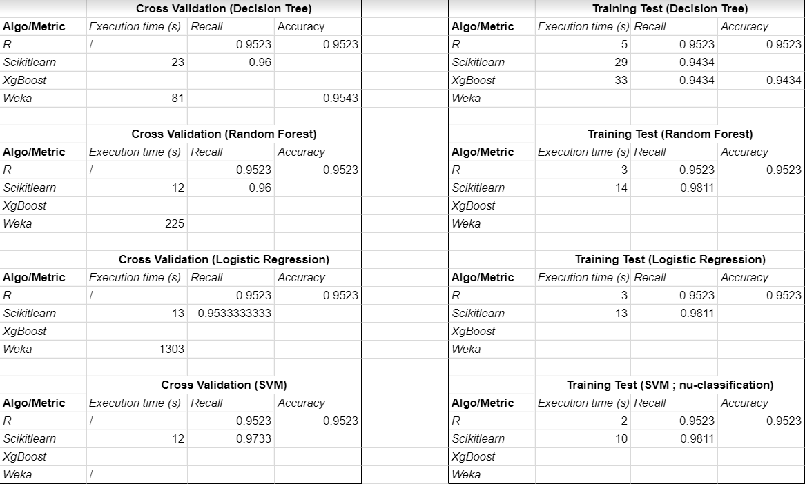

# MML-classification
## multi machine learning language (for classification) 

###Introduction

**Datasets**
We used the iris dataset, the variable to predict beeing the flower variety (Setosa, Versicolor or Virginica) using sepal length & width and petal length & width.

**Implemented compilers**
+ Scikitlearn : A free Python library for machine learning.
+ R : A programming language and open source software for statistics and data science. 
+ Weka : A suite of machine learning software written in Java.
+ XgBoost : An open source software library for implementing Gradient boosting methods in R, Python and Julia.

###Results

### Answers to the requested questions

**On your datasets, which framework + algorithm is best ranked (compared to other frameworks) in terms of :**
+ Execution time : R is taking from 6 to 15 seconds (depending on the algorithm) to process iris.csv dataset. Weka is a bit slower, and Scikitlearn is the fastest.
+ Recall : R algorithms have a recall of 0.95. Weka : ... and Scikitlearn : 0.98

**Among machine learning frameworks and algorithms, are some implementations significantly slower/precise than others ?**
+ Sickit-learn seems more precise, with a recall at 98 percent

**Given a machine learning algorithm (e.g., decision tree), do we observe differences (execution time/precision) between frameworks?**
* Decision Tree: 
	* R execution time (Training test) = 5s, recall = 0.9523, precision = 0.9583;
	* Weka execution time (Cross validation) = 81s, recall = 0.9533, precision = 0.9543; 
* Random Forest: 
	* R execution time (Training test) = 3s, recall = 0.9523, precision = 0.9583;
	* Weka execution time (Cross validation) = 225s, recall = 0.9466, precision =0.9471 ; 
* Logistic Regression:
	* R execution time (Training test) = 3s, recall = 0.9523, precision = 0.9583;
	* Weka execution time (Cross validation) = 1303s, recall = 0.8466, precision = 0.8481; 
* SVM (gamma=3.2 Cost=1.0 nu-classification):
	* R execution time (Training test) = 2s, recall = 0.9523, precision = 0.9583;
	* Weka execution time (Cross validation) = , recall = , precision = ; 

**Are there more difficult datasets to process in terms of:**
+ Recall? ...
+ Execution time ? : .....

**In light of the results, which machine learning framework do you recommend?**
R and Python both have great communities providing documentation & libraries, whereas few documentation was found about Weka.
Globally, Weka is taking way more time than others frameworks to process the dataset for similar results.
About the results, ...

### Required configuration

**R :**
+ add C:\Program Files\R\R-3.6.2\bin\x64 (or equivalent) to your PATH
+ add options(repos = "https://cran.r-project.org/",menu.graphics = FALSE) to your RProfile configuration file.
+ you may need to launch Eclipse with privileges in order to install R libraries correctly.

**Scikitlearn :**
+ In ScikitLearnCompilateur.java, replace python.exe's path by your own.

**XgBoost :**
+ In XgboostCompilateur.java, replace python.exe's path by your own.

**Weka :**
+ In org.xtext.example.mml.tests, add weka-3.7.jar as an external library. (Download link : http://www.java2s.com/Code/Jar/w/Downloadweka370jar.htm)

### Problems encountered
+ No SVM & Training Test implementations was found for Weka.
+ Only precision & recall metrics were retrievable from Weka.
+ We were unable to fetch and write XgBoost's metrics to a CSV file.
+ We have to install R libraries a the beginning of each execution.
+ CrossValidation with R only works when the file is executed in RStudio, not when executed using RScript.
+ Weka won't create a model for Logistic Regression with iris dataset beacause it is too small.
+ R's recall & precision are the same, regardless of the algorithm used.
